# Rumbo a Ibiza: informe

Juego web 3D de «crear y vestir muñecas fashion», hecho como regalo para Clara. El tema central es que nos vamos a vivir juntos a Ibiza.

Stack:

- **Base:** Vite 8, React 19 y TypeScript.
- **3D:** three.js r186 con @react-three/fiber, @react-three/drei y @react-three/postprocessing.
- **Estado e interfaz:** zustand y framer-motion.
- **Audio:** Web Audio sintetizado.
- **Fuentes:** @fontsource (Fredoka y Nunito).

No usa backend ni recursos externos en tiempo de ejecución. Todo, incluidas las muñecas, se genera por código.

## Qué se ha construido

### Personajes (100 % originales y procedurales)

- **Cuatro muñecas**, cada una con ficha (personalidad, estilo y frase) en el selector del estudio:
  - **Clara**, la protagonista, de estilo glam mediterráneo.
  - **Nayra**, deportiva street.
  - **Vega**, rockera.
  - **Alba**, romántica boho.
- **Clara según la descripción:**
  - Pelo caoba recogido en moño bajo, con raya al medio y la frente despejada.
  - Piel clara, cejas arqueadas, ojos oscuros y labios carnosos.
  - Uñas oscuras y un reloj inteligente de correa clara en la **muñeca izquierda**.
- **Cuerpo paramétrico:**
  - Torso con sección superelíptica y busto y glúteos esculpidos.
  - Extremidades por barrido con perfiles de radio y una cabeza esculpida con forma de corazón.
  - Manos con dedos y uñas, y pies con flexión plantar según la altura del tacón.
- **Esqueleto jerárquico** con 15 articulaciones y cinemática inversa de dos huesos para los brazos.
- **Ocho poses** (natural, mano en la cadera, paz, beso, mano en el pelo, pierna cruzada, saludo, estrella) más una pose de portada y el ciclo de paseo de pasarela.
- **Animación en reposo:** respiración, balanceo, cambio de peso, parpadeo y balanceo de coletas.
- **Cara pintada en textura** (estilo muñeca) con capas de maquillaje: ojos con iris, brillos y pestañas, cejas y labios con volumen. Tres expresiones: sonrisa, guiño y seria.

### Vestidor

| Categoría | Opciones |
|---|---|
| Tops | 15 |
| Partes de abajo | 14 |
| Vestidos y monos | 15 (incluidas la cola de sirena y el vestido de hada) |
| Chaquetas y capas | 14 (incluidas las alas de hada) |
| Calzado | 14 (plataformas, botas, deportivas, tacones, sandalias…) |
| Bolsos | 12 |
| Joyas | 16 (pendientes, collares y pulseras) |
| Gafas | 12 |
| Gorros | 12 |
| Accesorios del pelo | 14 |

- La mayoría de prendas permiten editar el color y, en ropa, bolsos y gorros, también el estampado.
- Hay 14 estampados procedurales en canvas, recoloreables: denim, escocés, leopardo, cebra, purpurina, lentejuelas, satén, rejilla, corazones, estrellas, flores, rayas, escamas y liso.
- **Materiales físicos por tejido:**
  - Sheen en telas.
  - Clearcoat en charol y vinilo.
  - Iridiscencia en lo holográfico, las perlas y las escamas.
  - Metal y gemas en joyería.
- **Sin clipping:** la ropa son capas desplazadas sobre la superficie del cuerpo. Las faldas se deforman cada frame para envolver las piernas en cualquier pose.
- **Peluquería:** 20 peinados (ver «Pelo de nueva generación») con color base, mechas, puntas de color fantasía (shader propio) y brillo ajustable.
- **Maquillaje por capas:** sombra, delineado (fino, gato o gráfico), pestañas, colorete, iluminador, labios (mate, gloss o metalizado) y pegatinas o gemas (estrellas, corazones, brillantes, pecas, mariposa). Cada uno con su paleta y su intensidad.
- **Uñas:** cinco formas, doce colores y cuatro acabados, visibles con la cámara de manos.
- **Etiquetas y rareza:** cada prenda tiene etiquetas de estilo y una rareza (común, especial o secreta).

### Modos de juego

1. **Estudio libre:**
   - Girar la muñeca con el dedo y hacer zoom con pellizco o rueda.
   - Cámaras predefinidas: cuerpo, cara, manos y pies.
   - Botón «Sorpréndeme» para un look aleatorio y guardado de looks.
2. **Sesión de fotos:**
   - Siete escenarios: discoteca de neón, centro comercial, playa al atardecer, alfombra roja con flashes, habitación Y2K, Ibiza al atardecer y el secreto **Nuestra casa en Ibiza**.
   - Ocho poses, expresión, cinco marcos y ocho pegatinas arrastrables.
   - Disparo con flash y sonido, y descarga en PNG de 1080×1440.
3. **Retos de estilo:**
   - Quince retos, con cuenta atrás opcional en los que la tienen.
   - Puntuación de 1 a 5 estrellas según etiquetas, colores (paleta o armonía), accesorios y look completo.
   - Jurado de tres personajes originales con comentarios divertidos.
4. **Pasarela:** desfile con cámara cinematográfica en tres planos, luces LED, flashes y música propia.
5. **Armario:** guardar, renombrar, duplicar, borrar y ponerse looks, con miniatura renderizada.

### Progresión y sorpresas

- **Monedas de purpurina:** se ganan en los retos (solo cuenta la mejora sobre la mejor puntuación) y se gastan en la tienda (prendas especiales).
- **Prendas secretas con nombres de Ibiza:**
  - Cola de sirena de Es Vedrà y Top de conchas de Cala Comte: se ganan superando el reto de la sirena.
  - Vestido de hada de los almendros y Alas de hada de luz: reto del hada.
  - Perlas del Mediterráneo: completar 10 retos.
  - Tiara de perlas: encontrar el corazón escondido.
  - Corona de hada: ver el final.
- **Final:** se desbloquea al completar los 15 retos o al tocar 5 veces el corazón de la portada. Lleva a una pasarela especial en Ibiza (Clara de hada, con pétalos y el atardecer frente a Es Vedrà) y a una carta animada sobre mudarnos juntos. El texto se edita en `src/data/story.ts`.
- **Escenario secreto:** «Nuestra casa en Ibiza», una pared encalada con puerta azul en arco, buganvillas, guirnalda de luces, columpio y una mesa con dos tazas.
- **Onboarding:** tres pasos interactivos (tocar una prenda, girar a Clara y ver lo de las monedas).

### Sonido

- Música pop original sintetizada con Web Audio, con tres pistas (menú, pasarela y final), batería, bajo, pads, arpegios y melodía.
- Efectos: clic, destello, moneda, obturador, fanfarria y error.
- Arranca con «Toca para empezar». Los botones de silencio están siempre visibles.

### Rendimiento y compatibilidad

- **Calidad automática** (baja, media o alta), con selector manual en `?debug=1`.
- **DPR adaptativo** con PerformanceMonitor: baja la resolución y después la calidad.
- **Niveles de detalle geométrico** por calidad.
- **Menos llamadas de dibujo:** las piezas se fusionan por hueso y material, y las manos se precalculan en varios niveles de flexión.
- **Lienzo ajustado:** el canvas 3D ocupa solo la zona libre de paneles.
- **Desenfoque:** el glassmorphism con desenfoque real solo se activa en calidad alta. En las demás se imita con degradados, porque el desenfoque sobre el 3D es muy caro.
- **Carga:** una portada 2D instantánea. El motor 3D se descarga y construye tras el primer toque, con barra de progreso, y cada modo va en su propio trozo de código.
- **Pantalla:** vertical y horizontal (en horizontal el panel va a la derecha), áreas seguras del notch y objetivos táctiles de 44 px o más.
- **Sin WebGL:** se muestra un mensaje amable.

## Pelo de nueva generación (tarea 2)

Cambios en `src/three/hair.ts` y `src/data/hair.ts`. Además, en `src/data/types.ts` se han añadido los tipos de las piezas nuevas.

### Aspecto

- **Brillo anisotrópico de Kajiya-Kay.** Cada vértice guarda la dirección de su mechón (`hairDir`) y el shader calcula dos lóbulos de brillo por cada luz direccional:
  - uno claro y estrecho, desplazado hacia la raíz;
  - otro teñido del color del pelo, más ancho y granulado con la propia textura.
  
  El resultado es la banda de brillo que sigue la forma de la cabeza, en lugar de la mancha de plástico de antes. El regulador **Brillo del pelo** controla su intensidad y su anchura.
- **Raíz más oscura** (atributo `hairR`): en melenas, coletas y trenzas, la raíz es más oscura. En el casquete se oscurecen la raya y el nacimiento del pelo.
- **Mechones sueltos en el contorno:** pelos finos que se despegan del casquete y de los lados de las melenas. Hay 8, 16 o 26 según la calidad (menos en los peinados pulidos), y se ocultan bajo los gorros.

### Física secundaria

- Las coletas, las trenzas, las melenas largas, los moños sueltos y sus mechones colgantes cuelgan de una **cadena de huesos con muelles**:
  - partículas integradas con Verlet, a 60 Hz con subpasos;
  - longitud fija entre nodos;
  - límite de desviación;
  - colisión con la cabeza;
  - una gravedad que solo actúa cuando la cabeza se inclina.
- La malla se deforma con *skinning* en la GPU (`SkinnedMesh`), así que el coste en la CPU es de unas pocas partículas por pieza.
- Al **girar** a la muñeca con el dedo o al **caminar** por la pasarela, el pelo se queda atrás, rebota y se asienta. En reposo hay una brisa muy suave.
- Cada tipo de pieza tiene su propio ajuste: la melena es rígida, la coleta es suelta y el moño solo tiembla.

### Peinados nuevos (de 16 a 20)

| Peinado | Piezas | Física |
|---|---|---|
| **Recogido de boda ibicenca** | Corona trenzada de sien a sien, moño bajo suelto, mechones cortos ondulados en la cara y flores (almendro, buganvilla y jazmín) alrededor del moño y en la sien | Moño y tres mechones colgantes |
| **Trenza lateral de espiga** | El pelo barre la nuca hasta una trenza gruesa que cae sobre el hombro | Trenza |
| **Moño despeinado** | Moño alto con lazadas flojas y mechones en la cara | Moño y tres mechones colgantes |
| **Coleta de burbujas** | Coleta alta dividida en cuatro burbujas con gomas | Coleta |

Las flores son geometría procedural con colores por vértice y *sheen*. No se usa ningún recurso externo.

### Antes y después

Las capturas están en `docs/screenshots/pelo/`: `antes/` y `despues/`. Se generan con `node scripts/hair-shots.mjs <carpeta> <peinados> [giro]`.

| Antes | Después |
|---|---|
| 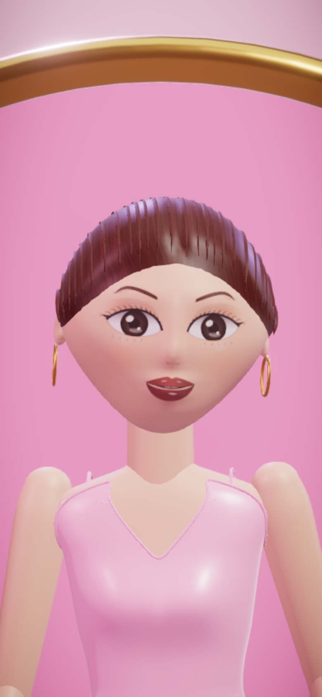 | 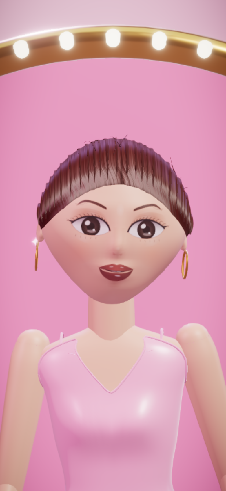 |
| 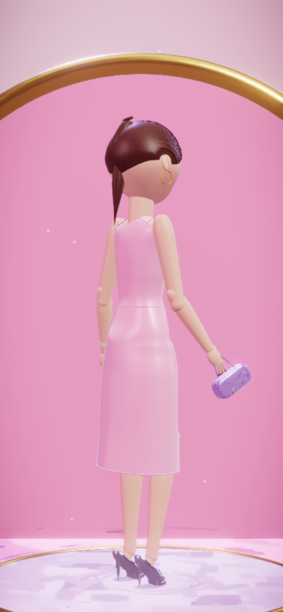 | 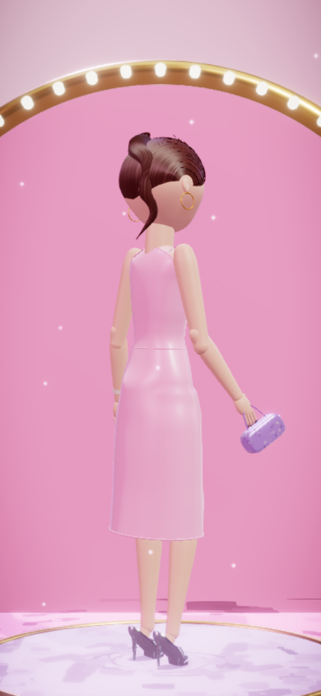 |

| Recogido de boda ibicenca | Trenza de espiga | Moño despeinado | Coleta de burbujas |
|---|---|---|---|
| 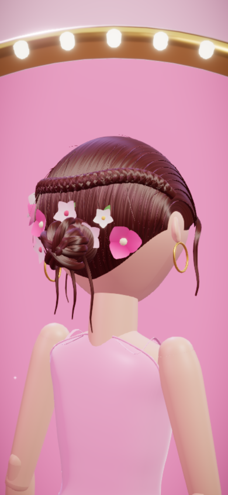 | 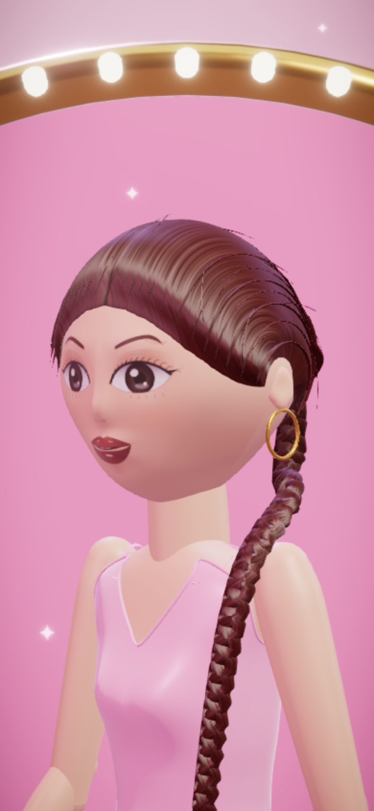 | 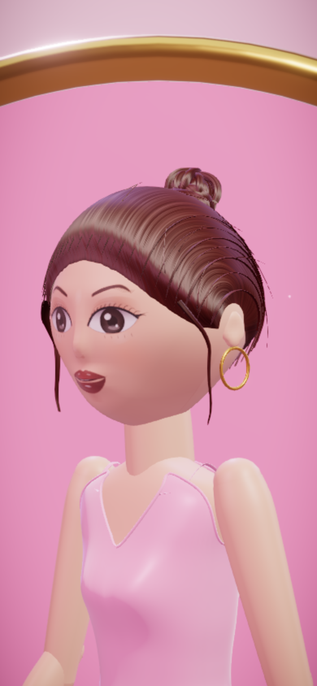 | 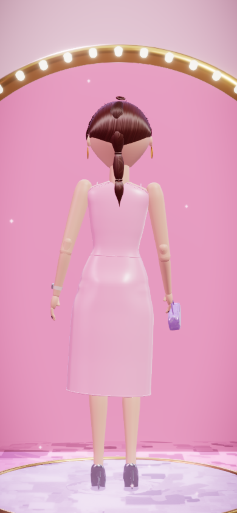 |

### Pruebas

- **Unitarias:** `tests/unit/pelo.test.ts` comprueba el catálogo: 20 peinados, ids únicos, las piezas del recogido de boda y que cada peinado nuevo tiene física.
- **E2E:** `tests/e2e/pelo.spec.ts`, en las tres resoluciones:
  - elegir los cuatro peinados nuevos, comprobando el número de cadenas de física;
  - que la coleta oscile al girar a la muñeca y se asiente después;
  - que las trenzas se muevan al caminar por la pasarela.
  
  Para eso, `window.__claraHair` expone el número de cadenas y el balanceo.
- RESULTADOS_E2E
- **Carga inicial:** sin cambios, unos 139 kB gzip. El código del pelo va en el trozo 3D, que pasa de unos 279 a unos 284 kB gzip.

### Límites

- Las cadenas no chocan con el cuerpo, solo con la cabeza. La desviación está limitada para que la coleta no atraviese la espalda en los giros normales, pero en un giro muy brusco puede rozarla.
- El *save* no cambia: los peinados nuevos son solo ids nuevos en `look.hair.styleId`.

## Capturas destacadas (ronda final)

| | | |
|---|---|---|
| 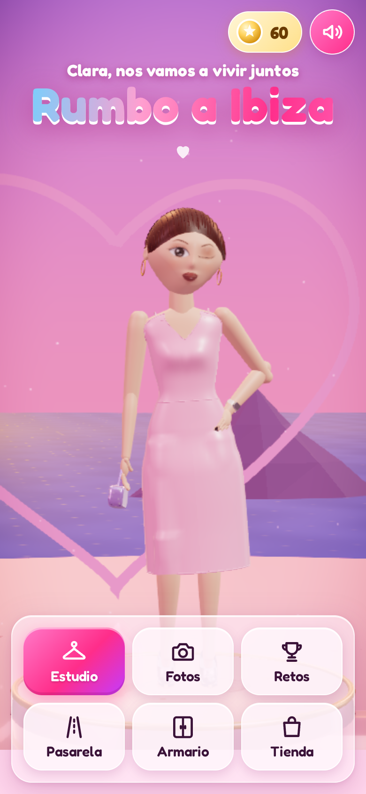 | 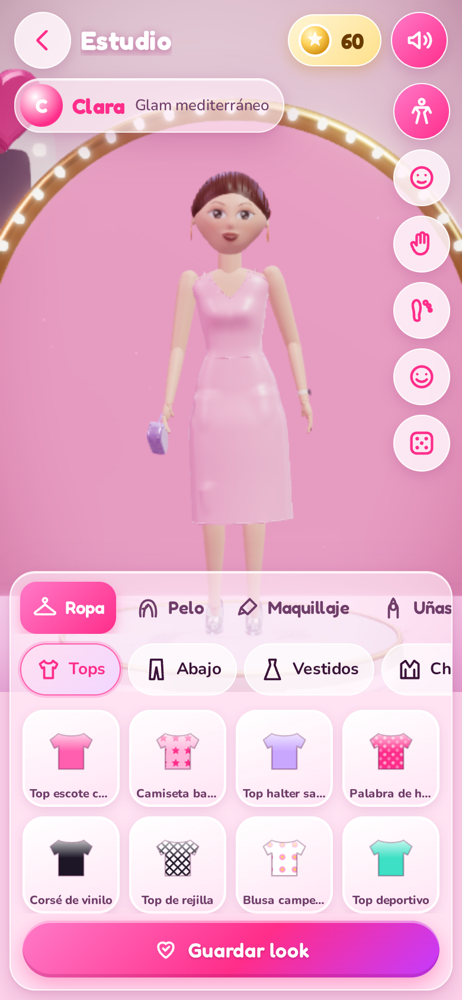 | 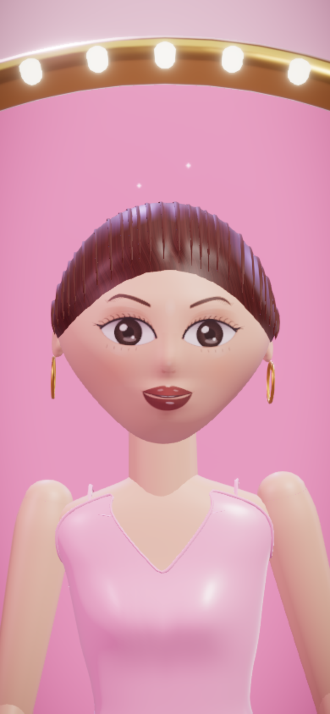 |
| 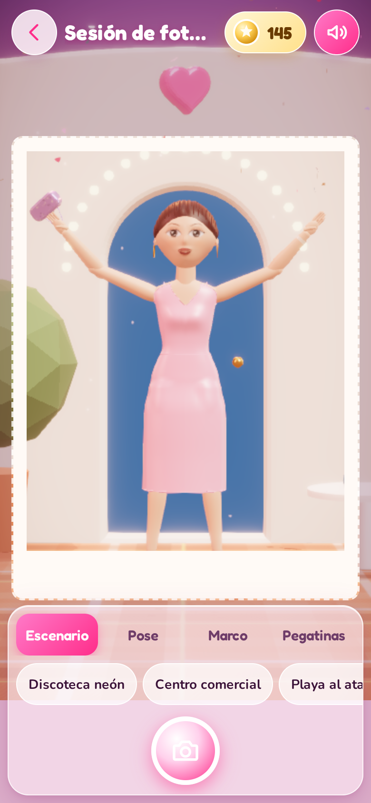 | 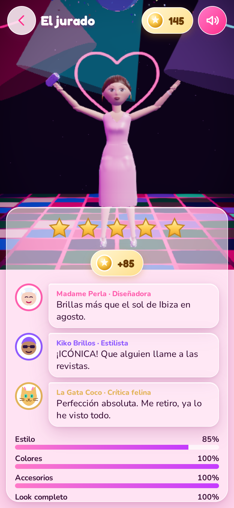 | 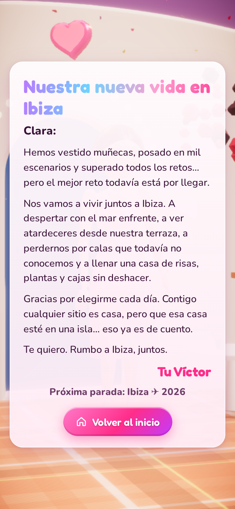 |

Todas las capturas, de cada ronda, están en `docs/screenshots/`.

## Resultados de las pruebas

| Prueba | Resultado | Objetivo |
|---|---|---|
| Unitarias (Vitest) | **35/35** en verde | todas en verde |
| Cobertura de `src/game` | **98,66 %** de sentencias, 92,99 % de ramas y 98,86 % de funciones | más del 80 % |
| E2E (Playwright, SwiftShader) | **24/24** en verde: 8 flujos en 390×844, 412×915 y 1440×900 | todas en verde |
| Errores de consola en E2E | **0** (la fixture `errors` hace fallar cualquier test que registre uno) | 0 |
| Lighthouse móvil | rendimiento **96**, accesibilidad **100** | más de 70 y más de 90 |
| Métricas de Lighthouse | FCP 2,1 s · LCP 2,3 s · TBT 80 ms · CLS 0,011 | — |
| FPS en el estudio, CPU 4x más lenta | **29,7** de media (otra ejecución: 30,2), calidad baja | 30 o más |
| FPS en la pasarela, CPU 4x más lenta | **35,5** de media | 30 o más |
| Bundle inicial | **unos 139 kB gzip** (JS de entrada y CSS) | menos de 1,5 MB |
| Bundle 3D (tras «Toca para empezar») | unos 420 kB gzip más | — |

Los flujos E2E cubren:

- El onboarding.
- Ponerse prendas de todas las categorías, peinado, maquillaje y uñas, y probar todas las cámaras.
- Guardar un look, recargar la página y usar el armario (renombrar, duplicar y borrar).
- Una foto en cada escenario, comprobando la firma del PNG.
- Un reto, con su puntuación y sus monedas.
- Comprar en la tienda.
- El final del corazón, con la carta y la foto del escenario secreto.
- El final completando los 15 retos.

Los datos crudos de FPS están en `docs/perf.json`. Se miden con `node scripts/perf.mjs`.

**Sobre los FPS:** este entorno no tiene GPU, así que el renderizado se hace por software con SwiftShader, que es muchísimo más lento que cualquier móvil real. El sistema adaptativo reduce la resolución y la calidad hasta rondar los 30 fps incluso en esas condiciones. En un móvil real con GPU, la calidad automática se queda en media o alta.

## Histórico de puntuaciones visuales

Detalle completo, con criterios y problemas de cada captura, en [`docs/visual-review.md`](docs/visual-review.md).

| Ronda | Nota media | Nota mínima | Principales correcciones tras la ronda |
|---|---|---|---|
| 1 | 4,7 | 2 | Sin animaciones de salida que dejaban la interfaz a medias, márgenes con paneles ocultos, encuadre de manos, pelo con mechones, cara de Clara refinada |
| 2 | 6,5 | 4 | «Nuestra casa» rediseñada, mandíbula en forma de corazón, muslo sin atravesar la ropa, cámara de pasarela, centro comercial con más color |
| 3 | 7,1 | 6 | Falda sin manchas en la cadera, manos con uñas y reloj, velo en el armario, piel de vinilo, ojos más grandes |
| 4 (final) | 7,2 | 7 | Centro comercial rediseñado (de 6 a 7) |

(24 capturas por ronda.) Las notas son estrictas: un 8 significa «parece un juego comercial».

## App instalable, sin conexión y publicación (tarea 10)

### Antes y después

| | Antes | Después |
|---|---|---|
| Arranque (mientras llega el JavaScript) |  | 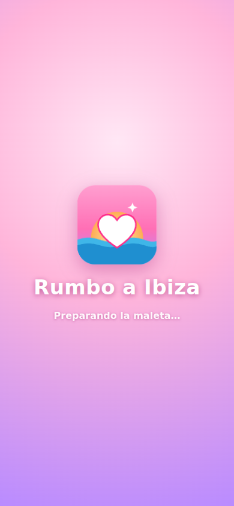 |
| Recargar sin conexión |  | 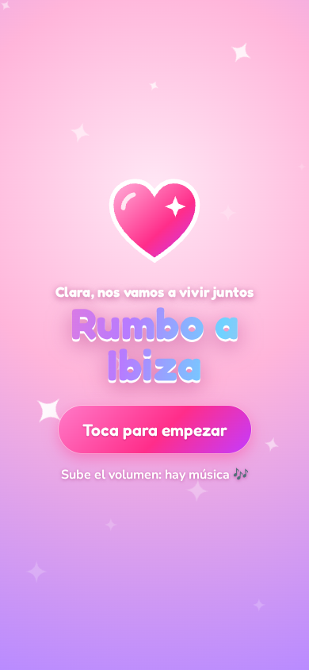 |
| Sin conexión, tras «Toca para empezar» | — (no carga) | 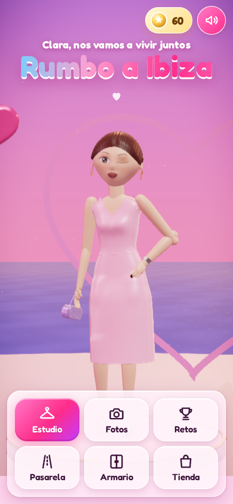 |

Las capturas se regeneran con `node scripts/pwa-shots.mjs antes|despues` (con `npm run preview` en marcha).

### Qué se ha hecho

- **Manifest** (`public/manifest.webmanifest`): nombre «Rumbo a Ibiza», en español, `standalone`, rutas relativas (vale con cualquier `BASE_PATH`), colores de la marca e iconos 192 y 512, maskable y SVG.
- **Icono propio** (`public/icon.svg`): puesta de sol sobre el mar de Ibiza con un corazón y destellos. Los PNG (incluido `apple-touch-icon.png` para iOS) salen de `node scripts/icons.mjs`. El dibujo de la versión maskable cabe en la zona segura.
- **Pantalla de arranque**: va dentro de `index.html` con CSS en línea, así que se ve al instante, antes de que se descargue el JavaScript (antes, una pantalla rosa vacía). React la sustituye al montar. En Android, además, el sistema compone su propia pantalla con el icono y `background_color`.
- **Service worker** (`public/sw.js`): al compilar, un pequeño plugin de `vite.config.ts` le inyecta la lista de archivos de `dist/` y una versión (hash del contenido) y registra el service worker solo en producción.
  - Se precarga **todo el juego** (unos 630 kB gzip, incluidos el motor 3D y todos los modos), así que tras la primera visita funciona sin conexión de principio a fin.
  - Archivos con hash: caché primero. Navegación: red primero (para recibir actualizaciones) y, sin red, la portada guardada.
  - Al publicar una versión nueva, se instala en segundo plano y se activa la próxima vez que se abre la app; las cachés antiguas se borran entonces.
  - La carga inicial no cambia: el service worker se registra tras el evento `load` y la precarga va en segundo plano.
- **Guardado**: no se ha tocado. La partida sigue en `localStorage` y funciona igual sin conexión.

### CI y publicación

- **`.github/workflows/ci.yml`** (en cada push y PR), tres trabajos:
  1. Tests unitarios, build y **comprobación del tamaño** (`npm run size`, `scripts/check-size.mjs`): HTML, JS de entrada, CSS y fuentes iniciales deben sumar menos de **1,5 MB gzip**; si no, falla.
  2. **Lighthouse CI** (`.github/lighthouserc.json`, perfil móvil, mediana de 3 pasadas). Umbrales que hacen fallar: rendimiento ≥ 80, accesibilidad ≥ 90, buenas prácticas ≥ 90, LCP ≤ 4 s y CLS ≤ 0,1. Avisos: SEO ≥ 80, FCP ≤ 3 s y TBT ≤ 400 ms. Los informes quedan como artefacto.
  3. **E2E** con Playwright y Chromium (todas las suites, los tres tamaños de pantalla).
- **`.github/workflows/deploy.yml`**: listo. Al hacer push a `main`, pasa tests, compila con `BASE_PATH=/<repo>/`, comprueba el tamaño y publica en GitHub Pages.

### Resultados

| Prueba | Resultado |
|---|---|
| E2E nuevos (`tests/e2e/pwa.spec.ts`) | manifest e iconos válidos, Chrome no da ningún error de instalabilidad, la pantalla de arranque se ve sin JavaScript, y sin conexión se carga la portada, el motor 3D y el estudio; 0 errores de consola |
| Lighthouse CI (local, 3 pasadas) | rendimiento 96–99, accesibilidad 100, buenas prácticas 100, SEO 100 · FCP 1,5 s · LCP 1,5 s · TBT 110–190 ms · CLS 0,011 |
| Carga inicial | **230,5 kB gzip** contando las 6 fuentes woff2 (139 kB solo JS y CSS); límite 1,5 MB |

### Lo que falta y depende del dueño del repo

- Hacer el repositorio **público** (o tener un plan de pago) y en **Settings → Pages → Source** elegir **«GitHub Actions»**.
- Crear la rama `main`: el despliegue se lanza con cada push a `main` (o a mano desde la pestaña Actions).
- Instalarla en el móvil: Android/Chrome muestra «Instalar aplicación» en el menú; en iPhone, Safari → Compartir → «Añadir a pantalla de inicio». Hay que abrirla una vez con conexión para que se guarde.

## Limitaciones conocidas

- **Criterio visual no cumplido del todo:** en la última ronda ninguna captura baja de 7, pero muchas se quedan en 7 y no en 8. El factor limitante es el acabado de las muñecas, que son 100 % procedurales y no modelos esculpidos a mano. Es la mayor diferencia frente a un juego comercial.
- **FPS medidos con renderizado por software:** en el estudio con la CPU 4x más lenta la media es de 29,7 a 30,2 fps, justo en el límite de 30. Habría que medirlo en un móvil real.
- **No está desplegado todavía:**
  - El repositorio es **privado**, y GitHub Pages en repos privados requiere un plan de pago.
  - Pages no está activado.
  - Todavía no existe la rama `main`.
  - El workflow `.github/workflows/deploy.yml` ya está listo. Se despliega solo al hacer push a `main` en cuanto Pages esté activado con «Source: GitHub Actions» (ver el apartado de la tarea 10).
- **Textos de la carta provisionales:** el texto de la carta, la fecha («Próxima parada: Ibiza ✈ 2026») y la firma están en `src/data/story.ts` como borrador, a falta del texto definitivo.
- **Audio:** los navegadores exigen un gesto del usuario antes de sonar, por eso la música empieza tras «Toca para empezar».

## Tarea 3: animación y expresiones

**Transiciones entre poses** (`src/three/pose.ts`, `transitionCurve` y `transitionPose`):

- Cada cambio de pose dura unos 0,9 s y tiene una curva en tres fases: **anticipación** (retrocede un 8 % antes de arrancar), movimiento principal con un **sobrepaso** del 7 % y **asentamiento** con un rebote amortiguado.
- **Acción superpuesta:** la cadera arranca primero y cuello, cabeza, codos y muñecas la siguen con retrasos de 50 a 130 ms.
- Al coger impulso la cadera baja un poco, y el IK de pies lo convierte en una ligera flexión de rodillas.

**Pasarela** (`src/three/scenes/Runway.tsx`):

- **Pies plantados:** la muñeca ya no se desplaza a velocidad fija. El pie de apoyo queda fijo en el suelo y lo que se movería hacia atrás se convierte en avance (`DollRig.takeTravel`). El deslizamiento medido es de 0 mm por fotograma.
- **Frenada** con pasos más cortos al llegar al final.
- **Giro final de 360°** dando pasitos y apoyándose en el pie de apoyo (`pivotTo`). Después viene la pose, una media vuelta con pasitos, el regreso y otra media vuelta. Antes, el giro era instantáneo y los pies patinaban.

**IK de pies** (`DollRig.solveFeet` y `legIK`):

- En cada fotograma se mide la altura del talón y de la bola del pie (o de la suela del zapato, según `heelLift`) respecto al suelo.
- Si el pie atraviesa el suelo (por un hundimiento de cadera, el paseo o un saltito), se sube el tobillo con IK de dos huesos (la rodilla se dobla hacia donde ya apuntaba) y se conserva la orientación del pie.

**Expresiones** (`src/three/face.ts`): a sonrisa, guiño y seria se suman tres nuevas.

- **Sonrisa con dientes:** comisuras altas, dientes superiores con separaciones y cejas algo levantadas.
- **Sorpresa:** boca en «O», ojos un 7 % más grandes y cejas muy altas. Va acompañada de un respingo con la cabeza hacia atrás y los hombros arriba, que se relaja poco a poco.
- **Risa:** ojos cerrados en arco, boca muy abierta con lengua y una carcajada animada (la boca alterna dos aperturas, la cabeza se echa atrás y los hombros botan).
- **Al cambiar de expresión** hay un parpadeo rápido que disimula el cambio de textura. Las texturas se guardan en caché (hasta 10).
- En el estudio y en fotos, el botón de expresión recorre las seis (`src/ui/expressions.ts`) y tiene iconos nuevos.

**Reacciones al jurado** (`reactionFor`, `reactionPose` y `DollRig.react`):

| Estrellas | Reacción |
|---|---|
| 5 | Risa, dos saltitos y aplauso |
| 4 | Sonrisa con dientes, un saltito y aplauso |
| 3 | Sonrisa y aplauso |
| 1–2 | Sorpresa, encogiéndose de hombros con las palmas hacia fuera |

- **El saltito** tiene agachada previa, parábola de 8,5 cm con los pies recogidos y amortiguación al caer.
- **El aplauso** son unas tres palmadas por segundo, con las manos colocadas por IK delante del pecho.
- **Al terminar**, la muñeca pasa con transición a la pose del jurado y recupera su expresión.

**Pruebas:**

- `tests/unit/animacion.test.ts`, 12 tests: la curva, las transiciones, las reacciones, el saltito, las bocas y una simulación del rig que comprueba que los pies no atraviesan el suelo, que no patinan y que avanza.
- `tests/e2e/animacion.spec.ts`, 4 flujos por viewport: expresiones, transiciones, pasarela con giro y jurado.
- Las métricas (`DollRig.stats`) se exponen en `window.__clara.interaction.rig`.

**Capturas** en `docs/screenshots/animacion/`, con prefijo `antes-` y `despues-`. Se generan con `node scripts/anim-shots.mjs <prefijo>`.

| Antes y después | |
|---|---|
| Caras: las tres de antes frente a dientes, risa y sorpresa | 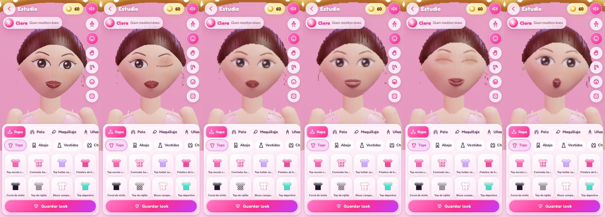 |
| Jurado: antes posaba sin más; ahora aplaude y salta | 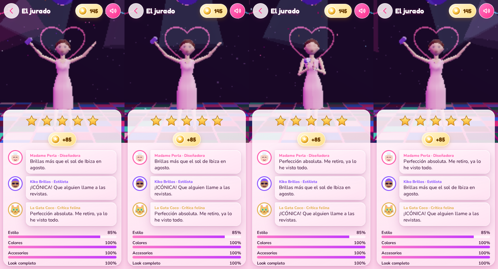 |
| Pasarela | 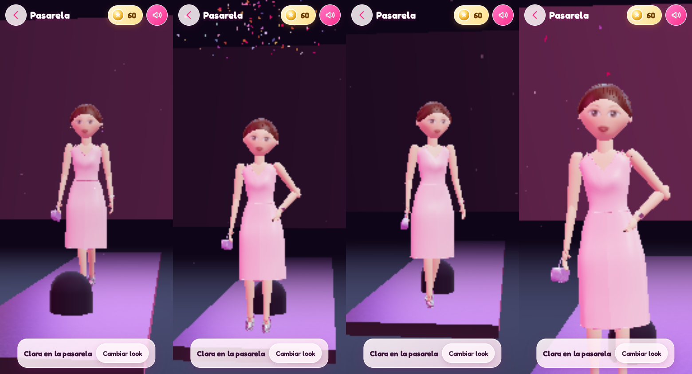 |
| Transición al saludo (fotogramas sucesivos) | 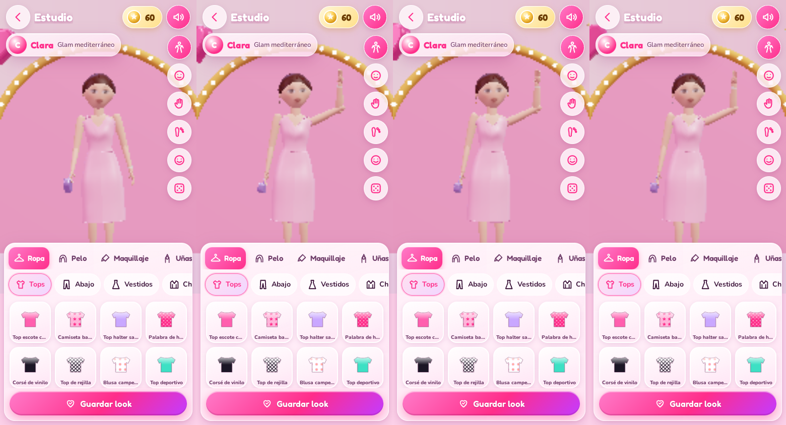 |

**Coste:** el bundle inicial no cambia (unos 139 kB gzip). El trozo 3D crece unos 3 kB gzip.

**Limitaciones:**

- El IK de pies solo empuja hacia arriba: no pega al suelo un pie que flota.
- El pie de apoyo en el paseo se decide por la fase del ciclo.
- Tras varios giros puede quedar una deriva lateral de pocos centímetros sobre la pasarela.

## Cómo añadir prendas nuevas

1. Abre `src/data/items.ts` y añade una línea en la categoría correspondiente con el helper `it(...)`:
   ```ts
   it('top-mi-prenda', 'Mi top nuevo', 'tops', 'top', 'satin', '#ff5fae', ['glam', 'fiesta'], {
     params: { neck: 'v', hem: 1.05, sleeve: 0, straps: 'thin' },
     pattern: 'estrellas',
     color2: '#ffffff',
   }),
   ```
   - **Id** único y **nombre** visible.
   - **Categoría** y **plantilla** (`model`). Las plantillas existentes son:
     - Prendas: `top`, `pants`, `skirt`, `dress`, `jumpsuit`, `jacket`, `cape`, `wings`, `mermaid`, `fairy`, `shellTop`.
     - Calzado: `heels`, `platform`, `boots`, `kneeboots`, `sneakers`, `sandals`, `ballet`, `wedge`, `flipflops`.
     - Bolsos: `baguette`, `heartBag`, `clutch`, `backpack`, `basket`, `tote`, `fanny`, `studded`, `fringeBag`, `furBag`, `discoBag`, `shellBag`.
     - Joyas, gafas, gorros y accesorios del pelo: consulta `src/three/clothes/accessories.ts`.
   - **Tejido** (`cotton`, `satin`, `denim`, `vinyl`, `leather`, `holo`, `sequin`, `knit`, `mesh`, `metal`, `gem`, `plastic`, `fur`, `pearl`, `scales` o `petal`), **color** y **etiquetas de estilo**.
   - **Opciones:** `params` (escote, largo, mangas, vuelo, tirantes…), `pattern`, `color2`, `rarity: 'especial'` con `price`, o `rarity: 'secreta'` con `unlock` y `story`.
2. Sin tocar más código, la prenda aparece en el estudio, en la tienda (si es especial o secreta), en la puntuación de los retos y en el modo «Sorpréndeme».
3. Lo mismo vale para el resto de datos:
   - Peinados en `src/data/hair.ts`, por composición de piezas.
   - Retos en `src/data/challenges.ts`.
   - Muñecas en `src/data/characters.ts`.
   - Escenarios y poses en `src/data/stages.ts`.
   - Textos del final en `src/data/story.ts`.
4. Ejecuta `npm test`: los tests comprueban que cada categoría tiene al menos 12 prendas, que los ids son únicos y que las especiales tienen precio.

## Estructura

```
src/data    catálogo tipado (prendas, peinados, maquillaje, retos, muñecas, escenarios, textos)
src/game    lógica pura: puntuación, economía, desbloqueos, guardado y migración, armario
src/store   estado global (zustand)
src/three   motor 3D: cuerpo, cara, pelo, ropa, materiales, texturas, escenas, efectos
src/ui      pantallas, componentes, iconos SVG propios
src/audio   música y efectos con Web Audio
tests/      unitarios (Vitest) y E2E (Playwright)
scripts/    capturas, medición de FPS, iconos, tamaño del bundle y utilidades de revisión
public/     manifest, service worker e iconos de la app instalable
.github/    CI (tests, tamaño, Lighthouse, E2E) y despliegue en Pages
```
