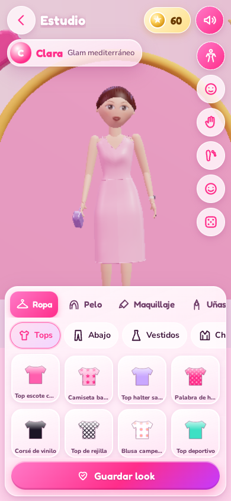
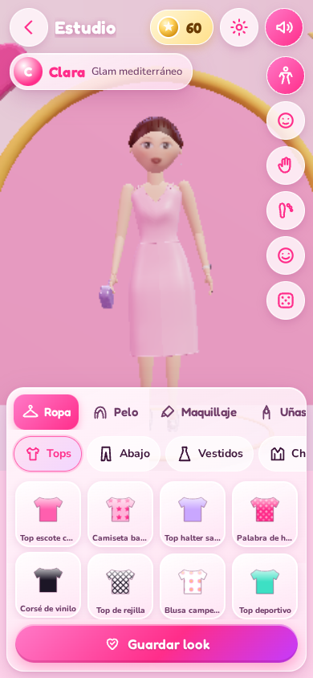
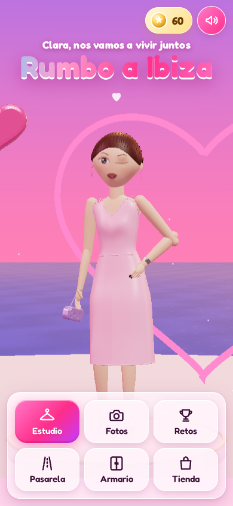
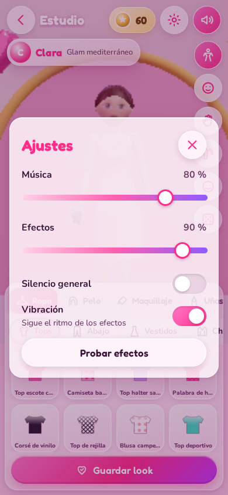

# Rumbo a Ibiza: informe

Juego web 3D de «crear y vestir muñecas fashion», hecho como regalo para Clara. El tema central es que nos vamos a vivir juntos a Ibiza.

Stack:

- **Base:** Vite 8, React 19 y TypeScript.
- **3D:** three.js r186 con @react-three/fiber, @react-three/drei y @react-three/postprocessing.
- **Estado e interfaz:** zustand y framer-motion.
- **Audio:** Web Audio sintetizado.
- **Fuentes:** @fontsource (Fredoka y Nunito).

No usa backend ni recursos externos en tiempo de ejecución. Todo, incluidas las muñecas, se genera por código.

## Qué se ha construido

### Personajes (100 % originales y procedurales)

- **Cuatro muñecas**, cada una con ficha (personalidad, estilo y frase) en el selector del estudio:
  - **Clara**, la protagonista, de estilo glam mediterráneo.
  - **Nayra**, deportiva street.
  - **Vega**, rockera.
  - **Alba**, romántica boho.
- **Clara según la descripción:**
  - Pelo caoba recogido en moño bajo, con raya al medio y la frente despejada.
  - Piel clara, cejas arqueadas, ojos oscuros y labios carnosos.
  - Uñas oscuras y un reloj inteligente de correa clara en la **muñeca izquierda**.
- **Cuerpo paramétrico:**
  - Torso con sección superelíptica y busto y glúteos esculpidos.
  - Extremidades por barrido con perfiles de radio y una cabeza esculpida con forma de corazón.
  - Manos con dedos y uñas, y pies con flexión plantar según la altura del tacón.
- **Esqueleto jerárquico** con 15 articulaciones y cinemática inversa de dos huesos para los brazos.
- **Ocho poses** (natural, mano en la cadera, paz, beso, mano en el pelo, pierna cruzada, saludo, estrella) más una pose de portada y el ciclo de paseo de pasarela.
- **Animación en reposo:** respiración, balanceo, cambio de peso, parpadeo y balanceo de coletas.
- **Cara pintada en textura** (estilo muñeca) con capas de maquillaje: ojos con iris, brillos y pestañas, cejas y labios con volumen. Tres expresiones: sonrisa, guiño y seria.

### Vestidor

| Categoría | Opciones |
|---|---|
| Tops | 15 |
| Partes de abajo | 14 |
| Vestidos y monos | 15 (incluidas la cola de sirena y el vestido de hada) |
| Chaquetas y capas | 14 (incluidas las alas de hada) |
| Calzado | 14 (plataformas, botas, deportivas, tacones, sandalias…) |
| Bolsos | 12 |
| Joyas | 16 (pendientes, collares y pulseras) |
| Gafas | 12 |
| Gorros | 12 |
| Accesorios del pelo | 14 |

- La mayoría de prendas permiten editar el color y, en ropa, bolsos y gorros, también el estampado.
- Hay 14 estampados procedurales en canvas, recoloreables: denim, escocés, leopardo, cebra, purpurina, lentejuelas, satén, rejilla, corazones, estrellas, flores, rayas, escamas y liso.
- **Materiales físicos por tejido:**
  - Sheen en telas.
  - Clearcoat en charol y vinilo.
  - Iridiscencia en lo holográfico, las perlas y las escamas.
  - Metal y gemas en joyería.
- **Sin clipping:** la ropa son capas desplazadas sobre la superficie del cuerpo. Las faldas se deforman cada frame para envolver las piernas en cualquier pose.
- **Peluquería:** 16 peinados con color base, mechas, puntas de color fantasía (shader propio) y brillo ajustable.
- **Maquillaje por capas:** sombra, delineado (fino, gato o gráfico), pestañas, colorete, iluminador, labios (mate, gloss o metalizado) y pegatinas o gemas (estrellas, corazones, brillantes, pecas, mariposa). Cada uno con su paleta y su intensidad.
- **Uñas:** cinco formas, doce colores y cuatro acabados, visibles con la cámara de manos.
- **Etiquetas y rareza:** cada prenda tiene etiquetas de estilo y una rareza (común, especial o secreta).

### Modos de juego

1. **Estudio libre:**
   - Girar la muñeca con el dedo y hacer zoom con pellizco o rueda.
   - Cámaras predefinidas: cuerpo, cara, manos y pies.
   - Botón «Sorpréndeme» para un look aleatorio y guardado de looks.
2. **Sesión de fotos:**
   - Siete escenarios: discoteca de neón, centro comercial, playa al atardecer, alfombra roja con flashes, habitación Y2K, Ibiza al atardecer y el secreto **Nuestra casa en Ibiza**.
   - Ocho poses, expresión, cinco marcos y ocho pegatinas arrastrables.
   - Disparo con flash y sonido, y descarga en PNG de 1080×1440.
3. **Retos de estilo:**
   - Quince retos, con cuenta atrás opcional en los que la tienen.
   - Puntuación de 1 a 5 estrellas según etiquetas, colores (paleta o armonía), accesorios y look completo.
   - Jurado de tres personajes originales con comentarios divertidos.
4. **Pasarela:** desfile con cámara cinematográfica en tres planos, luces LED, flashes y música propia.
5. **Armario:** guardar, renombrar, duplicar, borrar y ponerse looks, con miniatura renderizada.

### Progresión y sorpresas

- **Monedas de purpurina:** se ganan en los retos (solo cuenta la mejora sobre la mejor puntuación) y se gastan en la tienda (prendas especiales).
- **Prendas secretas con nombres de Ibiza:**
  - Cola de sirena de Es Vedrà y Top de conchas de Cala Comte: se ganan superando el reto de la sirena.
  - Vestido de hada de los almendros y Alas de hada de luz: reto del hada.
  - Perlas del Mediterráneo: completar 10 retos.
  - Tiara de perlas: encontrar el corazón escondido.
  - Corona de hada: ver el final.
- **Final:** se desbloquea al completar los 15 retos o al tocar 5 veces el corazón de la portada. Lleva a una pasarela especial en Ibiza (Clara de hada, con pétalos y el atardecer frente a Es Vedrà) y a una carta animada sobre mudarnos juntos. El texto se edita en `src/data/story.ts`.
- **Escenario secreto:** «Nuestra casa en Ibiza», una pared encalada con puerta azul en arco, buganvillas, guirnalda de luces, columpio y una mesa con dos tazas.
- **Onboarding:** tres pasos interactivos (tocar una prenda, girar a Clara y ver lo de las monedas).

### Sonido

- Música original sintetizada con Web Audio: pop para el menú y el final, balear chill en Ibiza, house en la discoteca, guitarra en casa y una pasarela adaptativa (ver «Banda sonora y sonido»).
- Efectos: clic, destello, moneda, obturador, fanfarria, error, tela, cremallera, tacones, joyas, cierre de bolso y aplausos del jurado.
- Ajustes con volumen de música y de efectos por separado, y vibración sincronizada.
- Arranca con «Toca para empezar». Los botones de silencio están siempre visibles.

### Rendimiento y compatibilidad

- **Calidad automática** (baja, media o alta), con selector manual en `?debug=1`.
- **DPR adaptativo** con PerformanceMonitor: baja la resolución y después la calidad.
- **Niveles de detalle geométrico** por calidad.
- **Menos llamadas de dibujo:** las piezas se fusionan por hueso y material, y las manos se precalculan en varios niveles de flexión.
- **Lienzo ajustado:** el canvas 3D ocupa solo la zona libre de paneles.
- **Desenfoque:** el glassmorphism con desenfoque real solo se activa en calidad alta. En las demás se imita con degradados, porque el desenfoque sobre el 3D es muy caro.
- **Carga:** una portada 2D instantánea. El motor 3D se descarga y construye tras el primer toque, con barra de progreso, y cada modo va en su propio trozo de código.
- **Pantalla:** vertical y horizontal (en horizontal el panel va a la derecha), áreas seguras del notch y objetivos táctiles de 44 px o más.
- **Sin WebGL:** se muestra un mensaje amable.

## Capturas destacadas (ronda final)

| | | |
|---|---|---|
|  |  |  |
|  |  |  |

Todas las capturas, de cada ronda, están en `docs/screenshots/`.

## Resultados de las pruebas

| Prueba | Resultado | Objetivo |
|---|---|---|
| Unitarias (Vitest) | **35/35** en verde | todas en verde |
| Cobertura de `src/game` | **98,66 %** de sentencias, 92,99 % de ramas y 98,86 % de funciones | más del 80 % |
| E2E (Playwright, SwiftShader) | **24/24** en verde: 8 flujos en 390×844, 412×915 y 1440×900 | todas en verde |
| Errores de consola en E2E | **0** (la fixture `errors` hace fallar cualquier test que registre uno) | 0 |
| Lighthouse móvil | rendimiento **96**, accesibilidad **100** | más de 70 y más de 90 |
| Métricas de Lighthouse | FCP 2,1 s · LCP 2,3 s · TBT 80 ms · CLS 0,011 | — |
| FPS en el estudio, CPU 4x más lenta | **29,7** de media (otra ejecución: 30,2), calidad baja | 30 o más |
| FPS en la pasarela, CPU 4x más lenta | **35,5** de media | 30 o más |
| Bundle inicial | **unos 139 kB gzip** (JS de entrada y CSS) | menos de 1,5 MB |
| Bundle 3D (tras «Toca para empezar») | unos 420 kB gzip más | — |

Los flujos E2E cubren:

- El onboarding.
- Ponerse prendas de todas las categorías, peinado, maquillaje y uñas, y probar todas las cámaras.
- Guardar un look, recargar la página y usar el armario (renombrar, duplicar y borrar).
- Una foto en cada escenario, comprobando la firma del PNG.
- Un reto, con su puntuación y sus monedas.
- Comprar en la tienda.
- El final del corazón, con la carta y la foto del escenario secreto.
- El final completando los 15 retos.

Los datos crudos de FPS están en `docs/perf.json`. Se miden con `node scripts/perf.mjs`.

**Sobre los FPS:** este entorno no tiene GPU, así que el renderizado se hace por software con SwiftShader, que es muchísimo más lento que cualquier móvil real. El sistema adaptativo reduce la resolución y la calidad hasta rondar los 30 fps incluso en esas condiciones. En un móvil real con GPU, la calidad automática se queda en media o alta.

## Histórico de puntuaciones visuales

Detalle completo, con criterios y problemas de cada captura, en [`docs/visual-review.md`](docs/visual-review.md).

| Ronda | Nota media | Nota mínima | Principales correcciones tras la ronda |
|---|---|---|---|
| 1 | 4,7 | 2 | Sin animaciones de salida que dejaban la interfaz a medias, márgenes con paneles ocultos, encuadre de manos, pelo con mechones, cara de Clara refinada |
| 2 | 6,5 | 4 | «Nuestra casa» rediseñada, mandíbula en forma de corazón, muslo sin atravesar la ropa, cámara de pasarela, centro comercial con más color |
| 3 | 7,1 | 6 | Falda sin manchas en la cadera, manos con uñas y reloj, velo en el armario, piel de vinilo, ojos más grandes |
| 4 (final) | 7,2 | 7 | Centro comercial rediseñado (de 6 a 7) |

(24 capturas por ronda.) Las notas son estrictas: un 8 significa «parece un juego comercial».

## Banda sonora y sonido (tarea de audio)

Todo sigue sintetizado con Web Audio, sin ficheros de audio: la carga inicial pasa de unos 139 kB a **unos 143 kB gzip**.

**Música por escenario** (en Fotos, Retos y Jurado; el resto de pantallas mantiene la pista del menú):

| Escenario | Pista | Cómo está hecha |
|---|---|---|
| Ibiza al atardecer y playa | Balear chill, 96 ppm | Guitarra de nailon pulsada (Karplus-Strong), shaker, bajo redondo, pads cálidos con reverberación y olas de mar de fondo |
| Discoteca neón | House, 124 ppm | Bombo a negras con «sidechain», charles abierto a contratiempo, palmas, bajo filtrado y acordes de piano sincopados |
| Nuestra casa en Ibiza | Guitarra, 84 ppm | Punteo alterno de bajo y agudos, rasgueo al final de cada vuelta y una melodía suave |

- **Pasarela adaptativa (114 ppm):** cada negra coincide con un paso del ciclo de paseo (1,9 pasos/s). Empieza con bombo, bajo y pad tras un filtro cerrado. Durante la ida el filtro se abre y entran el charles, las palmas, el arpegio y la melodía. Al posar llega el clímax (melodía doblada, platillo y aplausos). Las vueltas siguientes se quedan con la base completa.
- **Pasos a tempo:** suenan los tacones (o las botas o los zapatos planos, según el calzado puesto), alternando izquierda y derecha. El reloj de la música usa el mismo paso limitado que la escena, así que los tirones de carga no la desincronizan.
- **Cambios de pista** con un fundido corto. Si el hilo principal se atasca, el secuenciador se salta los pasos perdidos en vez de tocarlos todos de golpe.

**Efectos nuevos:**

- **Tela:** al ponerse tops, faldas, pantalones, capas o gorros.
- **Cremallera:** chaquetas, vestidos, monos, botas y mochilas.
- **Tacón o paso plano:** calzado.
- **Tintineo:** joyas, gafas y accesorios del pelo.
- **Cierre de bolso.**
- **Aplausos del jurado:** más palmas y un silbido cuantas más estrellas.

**Ajustes:**

- Botón de engranaje junto al de silencio, en la portada y en todas las barras superiores.
- Volumen de **música** y de **efectos** por separado, **silencio general**, **vibración** y botón **«Probar efectos»**.
- Al mover el volumen de efectos suena un tacón de muestra.
- Se guardan en una clave propia de localStorage (`clara-ibiza-audio`), sin tocar `SAVE_VERSION`.

**Vibración sincronizada:** cada efecto tiene un patrón que imita su ritmo (los dientes de la cremallera, las palmas, el «clinc» de la moneda…). Se lanza con la latencia de salida del audio para que coincida con el sonido, y los pasos de la pasarela vibran a tempo. La vibración corta de los botones no pisa el patrón de un efecto disparado en el mismo toque.

**Archivos:**

- `src/audio/engine.ts`: motor, pistas e instrumentos.
- `src/audio/mapping.ts`: lógica pura de pistas, efectos y desfile.
- `src/audio/director.ts`: decide qué suena en cada momento.
- `src/audio/settings.ts` y `src/audio/haptics.ts`: ajustes y vibración.
- `src/ui/Settings.tsx`: el panel de ajustes.
- Fuera de esa zona, solo cambia lo imprescindible: el engranaje en `kit.tsx` y `Home.tsx`, y que `App.tsx` usa el director.

**Pruebas:**

- `tests/unit/sonido.test.ts`: 6 pruebas unitarias.
- `tests/e2e/sonido.spec.ts`: 4 flujos × 3 tamaños de pantalla. Cubren los ajustes y su persistencia, la pista de cada escenario, el efecto y el patrón de vibración de cada tipo de prenda, la intensidad creciente de la pasarela, los pasos a tempo y los aplausos del jurado.

| Antes | Después |
|---|---|
|  |  |
|  |  |

**Limitación:** el sonido no sale en las capturas, así que se ha comprobado con el registro de efectos del motor (`window.__claraAudio`). En este entorno no hay altavoces: falta escucharlo en un móvil real para ajustar la mezcla a oído. La vibración solo existe en Android: Safari en iPhone no la permite.

## Limitaciones conocidas

- **Criterio visual no cumplido del todo:** en la última ronda ninguna captura baja de 7, pero muchas se quedan en 7 y no en 8. El factor limitante es el acabado de las muñecas, que son 100 % procedurales y no modelos esculpidos a mano. Es la mayor diferencia frente a un juego comercial.
- **FPS medidos con renderizado por software:** en el estudio con la CPU 4x más lenta la media es de 29,7 a 30,2 fps, justo en el límite de 30. Habría que medirlo en un móvil real.
- **No está desplegado todavía:**
  - El repositorio es **privado**, y GitHub Pages en repos privados requiere un plan de pago.
  - Pages no está activado.
  - Todavía no existe la rama `main`.
  - El workflow `.github/workflows/deploy.yml` ya está listo. Se despliega solo al hacer push a `main` en cuanto Pages esté activado con «Source: GitHub Actions».
- **Textos de la carta provisionales:** el texto de la carta, la fecha («Próxima parada: Ibiza ✈ 2026») y la firma están en `src/data/story.ts` como borrador, a falta del texto definitivo.
- **Audio:** los navegadores exigen un gesto del usuario antes de sonar, por eso la música empieza tras «Toca para empezar».

## Cómo añadir prendas nuevas

1. Abre `src/data/items.ts` y añade una línea en la categoría correspondiente con el helper `it(...)`:
   ```ts
   it('top-mi-prenda', 'Mi top nuevo', 'tops', 'top', 'satin', '#ff5fae', ['glam', 'fiesta'], {
     params: { neck: 'v', hem: 1.05, sleeve: 0, straps: 'thin' },
     pattern: 'estrellas',
     color2: '#ffffff',
   }),
   ```
   - **Id** único y **nombre** visible.
   - **Categoría** y **plantilla** (`model`). Las plantillas existentes son:
     - Prendas: `top`, `pants`, `skirt`, `dress`, `jumpsuit`, `jacket`, `cape`, `wings`, `mermaid`, `fairy`, `shellTop`.
     - Calzado: `heels`, `platform`, `boots`, `kneeboots`, `sneakers`, `sandals`, `ballet`, `wedge`, `flipflops`.
     - Bolsos: `baguette`, `heartBag`, `clutch`, `backpack`, `basket`, `tote`, `fanny`, `studded`, `fringeBag`, `furBag`, `discoBag`, `shellBag`.
     - Joyas, gafas, gorros y accesorios del pelo: consulta `src/three/clothes/accessories.ts`.
   - **Tejido** (`cotton`, `satin`, `denim`, `vinyl`, `leather`, `holo`, `sequin`, `knit`, `mesh`, `metal`, `gem`, `plastic`, `fur`, `pearl`, `scales` o `petal`), **color** y **etiquetas de estilo**.
   - **Opciones:** `params` (escote, largo, mangas, vuelo, tirantes…), `pattern`, `color2`, `rarity: 'especial'` con `price`, o `rarity: 'secreta'` con `unlock` y `story`.
2. Sin tocar más código, la prenda aparece en el estudio, en la tienda (si es especial o secreta), en la puntuación de los retos y en el modo «Sorpréndeme».
3. Lo mismo vale para el resto de datos:
   - Peinados en `src/data/hair.ts`, por composición de piezas.
   - Retos en `src/data/challenges.ts`.
   - Muñecas en `src/data/characters.ts`.
   - Escenarios y poses en `src/data/stages.ts`.
   - Textos del final en `src/data/story.ts`.
4. Ejecuta `npm test`: los tests comprueban que cada categoría tiene al menos 12 prendas, que los ids son únicos y que las especiales tienen precio.

## Estructura

```
src/data    catálogo tipado (prendas, peinados, maquillaje, retos, muñecas, escenarios, textos)
src/game    lógica pura: puntuación, economía, desbloqueos, guardado y migración, armario
src/store   estado global (zustand)
src/three   motor 3D: cuerpo, cara, pelo, ropa, materiales, texturas, escenas, efectos
src/ui      pantallas, componentes, iconos SVG propios
src/audio   música y efectos con Web Audio
tests/      unitarios (Vitest) y E2E (Playwright)
scripts/    capturas, medición de FPS y utilidades de revisión
```
